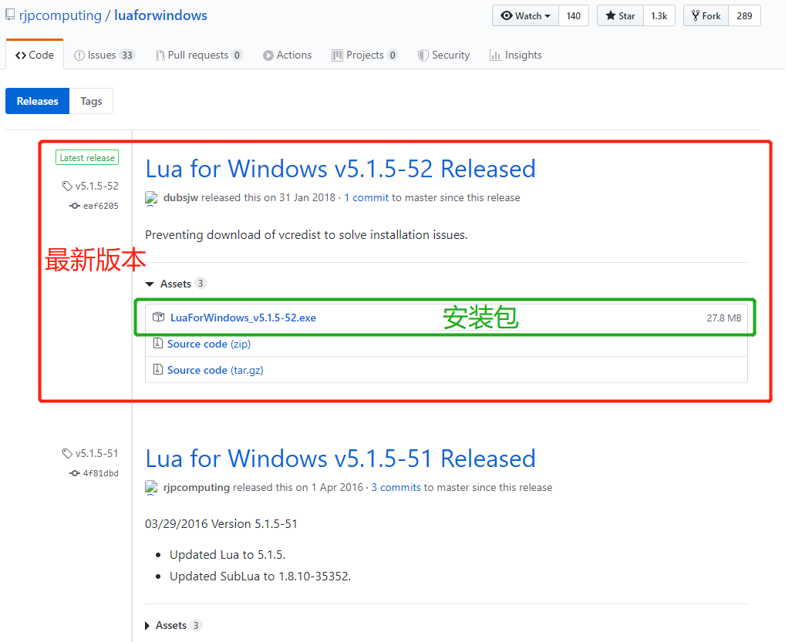

# lua 安装篇
## : 本篇笔记使用的环境
- 系统: window10
- lua版本: v5.1.5-52
- IDE: visual studio code
-----
> github: https://github.com/rjpcomputing/luaforwindows/releases

> 菜鸟教程:  https://www.runoob.com/lua/lua-environment.html

## 下载完成后直接双击完成安装即可

----
## visual studio code的一些配置
推荐安装插件 `Lua` 以及 `Lua Debug`, 这样visual studio code 就可以识别和调试lua文件了, 下面放上链接

Lua: https://marketplace.visualstudio.com/items?itemName=sumneko.lua

Lua Debug: https://marketplace.visualstudio.com/items?itemName=actboy168.lua-debug

