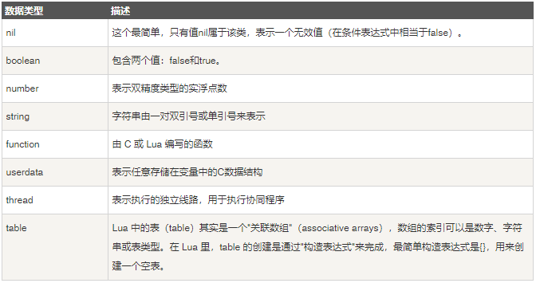
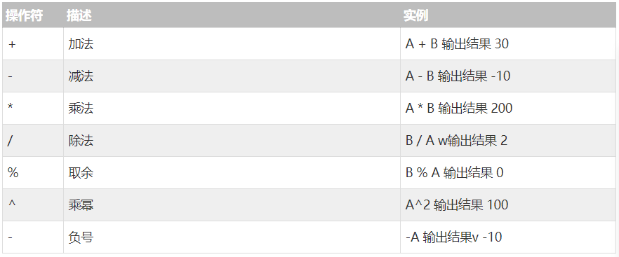
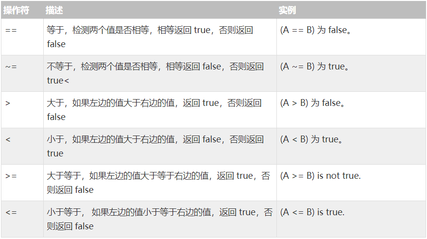
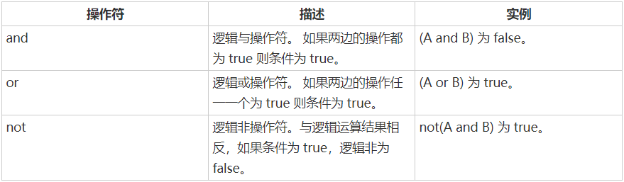
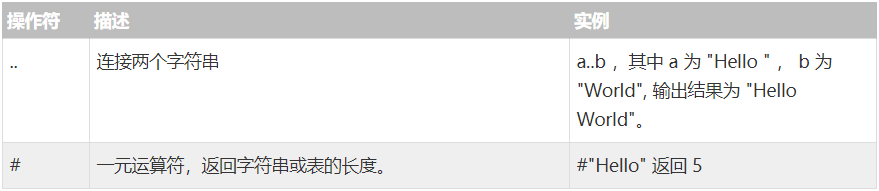

## 基本输出
``` lua
print('hello world!');
```

## 单行注释
```lua
-- 这是一行单行注释
print('hello world!');
```

## 多行注释
```lua
--[[
  这里可以写多行注释
  balalabalala...
--]]
```


## 变量声明
当你的变量没有声明时, 默认是`nil`, 表示一个无效值
```lua
lua_string = 'hello lua';
lua_boolean = true;
lua_number = 100;
lua_nil = nil;
lua_table = {key1 = 'val1', key2 = 'val2'};
lua_fn = function () end;

print(lua_string);
print(lua_number);
print(lua_nil);
print(lua_table);
print(lua_fn);
```

### 变量类型


## 局部变量
关键字 `local` 可以定义局部变量以使用
```lua
local lua_str = 'hello';
print(lua_str);
```
**无论是全局变量还是局部变量都可以反复定义, 如果先定义了局部变量, 那后面再定义全局变量其实是对这个局部变量的赋值操作**

## 赋值
lua 支持多变量赋值方式
```lua
local a, b, c = 1, 2, 3;
```
也可以利用这种方式进行数据交换
```lua
a, b = 1, 2;
a, b = b, a;
print(a, b); -- 2  1
```

## 循环
lua 语法提供了几种循环方式
1. while循环
2. for循环
3. repeat until循环

### while循环
一个简单的100次循环
```lua
-- 循环100次
local index = 1;

while(index <= 100) do
  print('当前是第', index, '次循环');
  index = index + 1;
end
```

### for循环
```lua
-- for 要循环的值, 循环到的值 每次递增的值 do
for index = 1, 100, 1 do
  print(index);
end
```


### repeat...until 循环
```lua
local index = 10;
repeat
  print(index);
  index = index + 1;
until( index > 15 );
```

## 流程控制 IF
```lua
-- if 条件成立 then 执行语句
if true then
  print('hello');
end
```

### if elseif 流程控制
```lua
local status = 1;

if (status == 0) then
  print('hello 1');
elseif (status == 1) then
  print('hello 2');
else
  print('hello 3');
end
```

## 函数
```lua
-- 定义一个局部函数
local function fn()
  return 100;
end

print(fn()); -- 100
```

函数可以返回多个返回值
```lua
-- 多返回值
local function fn2()
  return 1, 2;
end

local a, b = fn2();
print(a, b); -- 1 2
```

也可以不限定入参个数
```lua
-- 不限定入参的形式
local function fn4(...)
  print(...);
end

fn4(1, 2, 3, 4); -- 1, 2, 3, 4
```

参数也可以混用
```lua
-- ... 关键字与固定入参混用
local function fn5(a, ...)
  print(...);
end
```

## 运算符
 1. 算术运算符
 2. 关系运算符
 3. 逻辑运算符
 4. 其他运算符


### 算术运算符


### 关系运算符


### 逻辑运算符
`and` 运算符 跟 `or` 运算符并不总是返回true或false

- 当`and`前是`nil` 或 `false` 时会返回 `nil` 或 `false`
- 当`or`前是`nil` 或 `false` 时会返回 `or` 后的变量结果
```lua
print(nil or 100); -- 100
print(false or 100); -- 100
print(nil and 100); -- nil
print(false and 100); -- false
```


### 其他运算符

